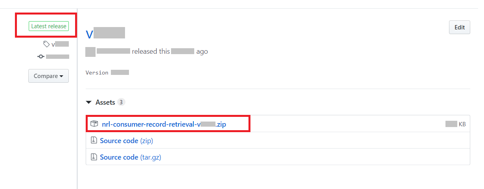
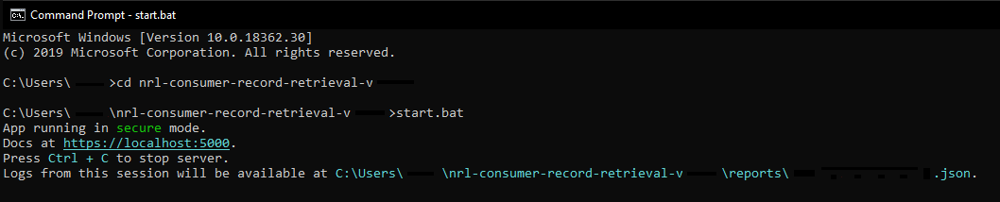

# Documentation

## Overview

The Consumer Record Retrieval Testing App is intended for Consumers to carry out conformance testing of their record retrieval capabilities, during local and INT stages of testing.

It consists of two main components:

*  A <abbr title="command-line interface">CLI</abbr> app. This must be running in order for the app to function.

*  A web <abbr title="application programming interface">API</abbr> that serves up dummy records or returns error responses in response to `GET` requests.

   The endpoints, records, and other options for this are user-configurable. A series of validations are carried out against each request, and reports are generated in JSON format, which can also be converted into human-readable HTML if required.

## Prerequisites

*   Install NodeJS (v10 or higher).

    You can check your NodeJS installation by running `node -v`.

    If you do not have NodeJS or your NodeJS version is too low, you can download it from [the NodeJS downloads page](https://nodejs.org/en/download/).
    
The required dependencies for running the testing app will be automatically installed when the app is first run. If the dependencies are already installed, this step will be skipped.

## Setup

1.  Download and extract the latest release from [the Releases page](https://github.com/nhsconnect/consumer-record-retrieval-test-app/releases).

    <div class="notice">

    **Note**: Make sure to select `nrl-consumer-record-retrieval-vX.X.X.zip`, which is the production build, rather than "Source code".

    </div>

    

2.  Configure SSL certificates and other options in `config.user.js` (see [Configuration Options](#configuration-options)).

3.  In a terminal, navigate to the location of the extracted files:

    ```
    cd <path to test app>
    ```

## Sending Requests

While the test app is running, requests can be sent to retrieve any of the records specified in the configuration, and the test app will run validations against those requests.

1.  Start the test app

    Windows (cmd):
    ```
    start.bat
    ```

    Linux (bash):
    ```
    ./start.sh
    ```

    

2.  Send `GET` requests to the relevant endpoints from the system-under-test.
    
    If `endpointFormat` is `"local"`, endpoints are constructed as if the root is the SSP URL, i.e. the Provider URL must be percent-encoded and appended to the root. Provider URLs are as configured in the `pathFileMapping` property of `config.user.js`.

    For example:

    ```
    https://provider1.example.com/api/patients/1/records/sample.json
    ```
    Becomes:

    <pre><code><span id="urlOrigin">&lt;rootUrl&gt;</span>/https%3A%2F%2Fprovider1.example.com%2Fapi%2Fpatients%2F1%2Frecords%2Fsample.json</code></pre>

Reports are output or persisted as specified in the `reportOutputs` property of `config.user.js`.

When collecting and providing evidence, make sure `reportOutputs.reportsDir` is set to `true` (default), run the tests as specified, and send the JSON report as evidence.

JSON reports can be converted into human-readable HTML format by running `node pretty-html -f <file name>`, or `node pretty-html` with no arguments to convert the most recently-created report.

## Configuration Options

Various configuration options are available in `config.user.js`:

Property                   | Type                         | Details
-------------------------- | ---------------------------- | ----------------------------
`endpointFormat`           |  `"local" \| "integration"`  | If `endpointFormat` is `"local"`, endpoints are constructed as if the root is the SSP URL, i.e. the Provider URL must be percent-encoded and appended to the root. Provider URLs are as configured in the `pathFileMapping` property.
`useFhirMimeTypes`         | `boolean`                    | If `true` (default), MIME types of JSON and XML responses will be set to `application/fhir+json` and `application/fhir+xml` respectively.
`explicitlySetUtf8`        | `boolean`                    | If `true`, append `;charset=utf-8` to MIME types.
`port`                     | `number`                     | The port over which to serve the test app.
`reportOutputs.stdout`     | `boolean`                    | Show report output in real-time in the terminal.
`reportOutputs.reportsDir` | `boolean`                    | Save reports as JSON files in `/reports` directory.
`logBodyMaxLength`         | `number`                     | Maximum chars of response body to log, after which the body will be truncated.<br>• `-1` logs the entire response body.<br>• `0` logs no response body.
`pathFileMapping`          | `{ [path: string]: string }` | To add records to test against, place the files in the `/responses` directory, and add a mapping for each to this property.<br><br>If `endpointFormat` is `local`, the key of each mapping must be a valid URL, but it doesn't have to point to anything.
`sslCACert`                | `string \| null`             | The <abbr title="certificate authority">CA</abbr> certificate, required for secure mode.
`sslServerCert`            | `string \| null`             | The server certificate, required for secure mode.
`sslServerKey`             | `string \| null`             | The server key, required for secure mode.
`secureMode`               | `boolean`                    | An override flag for secure mode, which by default is set whenever `sslCACert`, `sslServerCert`, and `sslServerKey` are all provided. Explicitly setting this to `false` can be used to quickly disable secure mode for debugging purposes.
